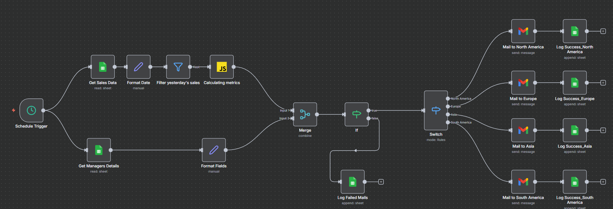
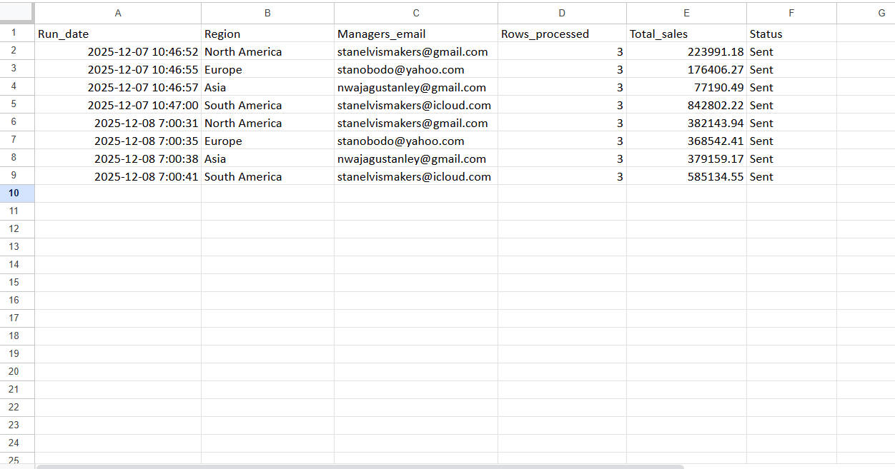

# Intelligent_Automated_Sales_Reporting_Pipeline

This project is an **end-to-end automated sales reporting pipeline** built using **n8n**. It processes raw daily sales, aggregates metrics by region, generates personalized reports, and emails each regional manager automatically every morning.

The pipeline is fully autonomous and requires **zero manual intervention** once deployed.

---

## Table of Contents

1. [Project Structure](#project-structure)
2. [Workflow Preview](#workflow-preview)
3. [Project Overview](#project-overview)
4. [Aim of the Project](#aim-of-the-project)
5. [Who This Project Is Built For](#who-this-project-is-built-for)
6. [Why This Project Matters](#why-this-project-matters)
7. [Features](#features)
8. [Tech Stack](#tech-stack)
9. [Testing Instructions](#testing-instructions)
10. [Future Enhancements](#future-enhancements)

---

## Project Structure

```
Intelligent_Automated_Sales_Reporting_Pipeline/
├── README.md                         # Project documentation
├── Docs/                             # Documentation files
├── Image/                            # Workflow diagrams and screenshots
│   └── n8n.png                      # n8n workflow diagram
├── Sample_data/                      # Sample datasets for testing
└── Workflow/                         # n8n workflow files
    ├── Core_code.json               # Main workflow logic & nodes
    ├── Workflow_export.json          # Complete workflow export
    ├── Workflow_diagram.md           # Workflow documentation
    └── Email_template.html           # HTML email template
```

**Directory Descriptions:**

| Directory | Purpose |
|-----------|---------|
| **Workflow/** | Complete n8n automation workflow with all nodes and configurations |
| **Sample_data/** | Test datasets for validating the pipeline |
| **Docs/** | Additional documentation and setup guides |
| **Image/** | Workflow diagrams and visual assets |

---

## Workflow Preview



## Project Overview

Modern organizations generate large volumes of sales data every day across multiple regions.  
Managers depend on timely and accurate reports to make decisions about inventory, performance, and strategy. However, many companies still rely on manual processes—exporting data, cleaning spreadsheets, performing regional breakdowns, and sending daily updates by email.

This project solves that problem by providing a **fully automated, intelligent reporting pipeline** that handles every stage of the daily sales reporting process without human involvement.

The pipeline is built with **n8n**, and it automatically processes raw sales data, aggregates regional metrics, generates product-level insights, and distributes personalized reports to each regional manager every morning.


## Aim of the Project

The main goal of this project is to **automate and streamline daily sales reporting** for multi-regional businesses by:

1. Eliminating manual spreadsheet tasks  
2. Reducing reporting errors  
3. Ensuring consistent daily delivery of sales summaries  
4. Giving managers fast access to the data they need  
5. Demonstrating how automation tools like n8n can improve business intelligence workflows  


This project also serves as a **portfolio-ready automation engineering showcase**, demonstrating ability to design:

- ETL workflows  
- Automated email delivery systems  
- Real-time data pipelines  
- Scalable business automation solutions  


## Who This Project Is Built For

This solution is designed for:

### **1. Businesses with multiple sales regions**
Companies operating across North America, Europe, Asia, South America, or multiple branches that rely on daily performance metrics.

### **2. Sales managers & regional heads**
Managers who need:

- Daily summaries  
- Product-level insights  
- Revenue tracking  
- Performance monitoring  

…without waiting for manual reports.

### **3. Data analysts & BI teams**
Who want to avoid repetitive tasks and focus more on insights than data cleaning and Emailing.

### **4. Automation & operations teams**
Who need reliable workflows for:

- Email notifications  
- Scheduled processes  
- Business reporting  
- Data quality enforcement  

### **5. Recruiters & hiring managers**
This project signals competence in:

- Workflow automation  
- Data engineering logic  
- API integrations  
- Real business process optimization  

It demonstrates practical, real-world automation skills that companies are actively hiring for.


## Why This Project Matters

Many companies waste time daily on manual sales reporting.  
This solution:

- Cuts down reporting time from **hours to seconds**  
- Removes human errors  
- Delivers consistent, formatted reports every day  
- Boosts productivity across the organization  
- Provides managers with near real-time insights  

In short, it turns a **manual daily task** into an **intelligent daily automation**.


## Features

### Automated Daily Sales Fetching  
- Pulls raw data from Google Sheets
- Cleans & formats timestamps   
- Extracts only yesterday’s sales  
- Supports unlimited daily sales volume  

### Regional Aggregation Engine  
- Calculates:
  - Total revenue per region  
  - Product-level revenue  
  - Record counts  
- Dynamically joins sales with manager lookup table  

### Personalized HTML Email Generation  
Each manager receives a unique summary containing:
- Their region’s total sales  
- Product-by-product breakdown  
- Date of report


### Sent email sample


### Conditional Branching (Switch Node)  
Routes each regional summary to the correct recipient:
- North America  
- Europe  
- Asia  
- South America  

### Logging System  
- Tracks successful emails  
- Captures errors with region + timestamp  


### Sent logs sample




## Tech Stack

| Technology | Purpose |
|-----------|---------|
| **n8n** | Workflow automation engine |
| **Google Sheets** | Data store (Sales + Managers) |
| **JavaScript (Code Node)** | Transformations & metrics |
| **Gmail API** | Email delivery |
| **Google Drive** | File access for sheets |


## Testing Instructions
Before activating schedule:

- Put your own email in the manager sheet

- Set yesterday’s date in sample sales data

- Run workflow manually

Confirm:

- Correct region grouping

- Email routing is accurate

- Logs are created correctly


## Future Enhancements

- Weekly & monthly rollups

- QuickChart API images in emails

- Power BI integration

- Slack or Teams notification channel

- Storing logs in PostgreSQL
